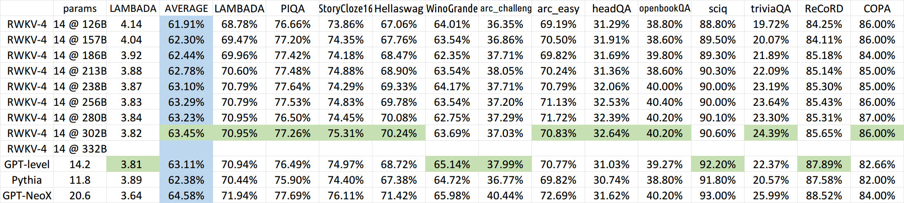

 	# Project code from  ChatRWKV introduce


ChatRWKV is like ChatGPT but powered by my RWKV (100% RNN) language model, which is the only RNN (as of now) that can match transformers in quality and scaling, while being faster and saves VRAM. Training sponsored by Stability EleutherAI :)

**Download RWKV-4 weights:** https://huggingface.co/BlinkDL (**Use RWKV-4 models**. DO NOT use RWKV-4a and RWKV-4b models.)

**RWKV LM:** https://github.com/BlinkDL/RWKV-LM (explanation, fine-tuning, training, etc.)

**RWKV Discord:** https://discord.gg/bDSBUMeFpc (let's build together)




# 7B 模型ffn层可视化

 

[详细介绍 RWKV 语言模型：具有 Transformer 优点的 CNN](https://blog.csdn.net/weixin_49139876/article/details/129869814?csdn_share_tail=%7B%22type%22:%22blog%22,%22rType%22:%22article%22,%22rId%22:%22129869814%22,%22source%22:%22weixin_49139876%22%7D)
# 前言
首先 为了对新手友好 简单讲一下什么是 RWKV LM, 这是一个开源LLM语言模型项目 .其性能与生态支持很好 例如:cuda重写了python代码 效率更高,有web 项目匹配,有chatrwkv,也可以运行在移动设备上 良好的跨平台能力,以及节省资源的特点 . 
	是目前唯一一个使用CNN也能达到同等transformer 类模型性能的 模型 

## 最近研发群里面看到大家在讨论 脑电图
大伙中有人想看RWKV fnn层响应可视化, 然后作者就发了一个效果图

显而易见的 看到 明显的异常值 大很多, 有人管这个叫做脑电图, 其实差不多 只不过不是特殊些的连续信号.  相信大老们肯定对此熟悉,但是对我来说第一次见到,非常好奇. 这种异常值统称outlier离群点.   而后另外一个佬做了一下430M模型各层的可视化

这个就更加离谱了, 离群点倍越往后就越大. 那么就好奇 如果这样的outline对语言模型很重要,而模型还拥有涌现能力与顿悟, 那么他们之间有什么联系?

1.首先我们阅读一下源码

```bash
 def forward(self, tokens, state=None, preprocess_only = False):
        # tokens=tokens.to('cpu').numpy().tolist()
        # if tokens is not None:
        #     print('input_tokens', len(tokens))
        # if state is not None:
        #     print('  input state',state.shape)
        with torch.no_grad():
            w = self.w
            args = self.args

            seq_mode = len(tokens) > 1

            x = w.emb.weight[tokens] if seq_mode else w.emb.weight[tokens[-1]]
            if self.RUN_DEVICE == 'cuda':
                x = x.cuda()

            if state == None:
                state = torch.zeros(args.n_layer * 5, args.n_embd, device=self.RUN_DEVICE)
                for i in range(args.n_layer):
                    state[5*i+4] -= 1e30

            SA = self.SA_seq if seq_mode else self.SA_one
            FF = self.FF_seq if seq_mode else self.FF_one
            all_ffn_out=[]
            for i in range(args.n_layer):
                ww = w.blocks[i].att
                x = x + SA(self.LN(x, w.blocks[i].ln1), state, i,
                    ww.time_mix_k, ww.time_mix_v, ww.time_mix_r, ww.time_first, ww.time_decay,
                    ww.key.weight, ww.value.weight, ww.receptance.weight, ww.output.weight)

                ww = w.blocks[i].ffn
                ffn_out=FF(self.LN(x, w.blocks[i].ln2), state, i,
                    ww.time_mix_k, ww.time_mix_r,
                    ww.key.weight, ww.value.weight, ww.receptance.weight)
                x = x + ffn_out
                all_ffn_out.append(ffn_out)
                # print('ffn->',x)
                if (i+1) % RWKV_RESCALE_LAYER == 0:
                    x = x / 2

            if preprocess_only:
                return state

            x = self.LN(x[-1,:], w.ln_out) if seq_mode else self.LN(x, w.ln_out)
            x = w.head.weight @ x
            # print('output',x.shape,'  out put state',state.shape)
            return x.float(),all_ffn_out, state
```


这里注意到ffn层 输出后 会被layernorm 泛化,但即使这样 也会有outlier 这就太奇怪了.
2.不同大小的模型可视化
为了探讨不同模型大小对outlier的影响我做了后续的可视化


1b5 fp32

1b5 fp16

7b fp16
## 单从可视化结果中可以得到3个结论
 - 结论一: 模型越大 outlier 情况越少
 - 结论二 量化 或者说精度的改变会影响 outlier
 - 结论三 outlier 的情况会直接影响模型的性能(并不严谨)
如何得出
## 如何得出结论 以下为可视化时控制变量的情况 
 - 全部输入都一致 为:` What is python? Please tell me in detail what it is, how to use it, how to learn it, and what advantages and disadvantages it has.`
 - 模型输出不可控
 - 结论一; 对比7b fp16 与 1b5 fp16 的模型可视化可直观看出 7b的outlier更小
 - 结论二,对比1b5 fp16 与 1b5 fp32 相同输入的情况下,多次试验结果都表明fp32 的输出比fp16 的输出更长 ,效果更好 猜测做量化的对齐 会保证性能的一致
 - 结论三  对于1b5模型而言(7b fp32 3090单卡跑不了 后续会补上) 不同的精度会导致outlier 情况有区别,  但是是否对模型性能有影响 要在后面的试验中来演示

## 进行可量化的评估试验
   #### 思路
- 1.通过使用KL散度 来评估相同情况下 模型大小,精度,不同输入 对outlier现象的影响
- 2.通过对outlier的操作(剔除,规范化等)来验证 不同层,大小 的outlier 的作用是什么
- 3.使用均方差来 评估不同模型大小,精度, ffn不同层 响应的离散程度 (outlier 的严重情况)
- 4.对目前开源的LLM模型进行相同的操作 来验证outlier 到底在干什么
- 5.目前没有太好的思路来验证 涌现与顿悟 跟outlier之间的关系,这应该要在训练的过程中来统计outlier的情况 并根据其他多任务的评估指标来评价 outler 到达何种程度后 顿悟/涌现 就出现了.


